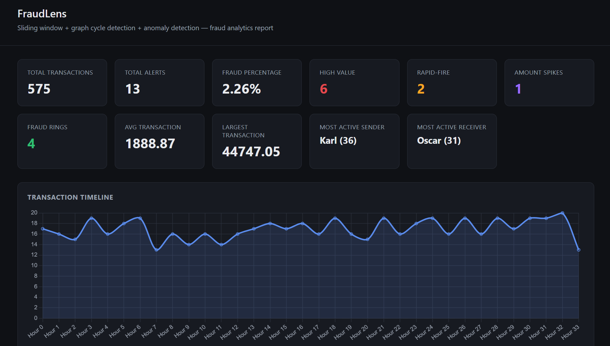
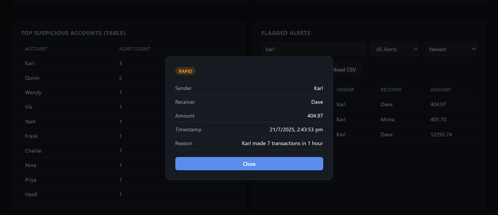

# 🚨 FraudLens

> **A Java-based Fraud Detection System using Sliding Window Analysis, Graph Cycle Detection, and Anomaly Detection with an Interactive Analytics Dashboard.**

FraudLens is a real-time inspired fraud analytics system that processes financial transactions, detects suspicious activities using multiple detection techniques, and generates an interactive dashboard for fraud investigation.

---

## Features

### ✅ High Value Transaction Detection
Detects transactions exceeding a predefined threshold.

### ✅ Rapid Transaction Detection
Identifies users performing multiple transactions within a short time window.

### ✅ Amount Spike Detection
Flags transactions that are significantly larger than a user's normal transaction pattern.

### ✅ Fraud Ring Detection
Uses graph cycle detection to identify suspicious transaction loops.

### ✅ Interactive Dashboard
Automatically generates a dashboard containing:

- Fraud statistics
- Transaction timeline
- Alert breakdown
- Suspicious accounts
- Search & filtering
- Alert details popup
- Export JSON
- Export CSV

---

# System Architecture

```
                   +----------------------+
                   |  CSV Transactions    |
                   +----------+-----------+
                              |
                              v
                +---------------------------+
                | TransactionCsvReader      |
                +-------------+-------------+
                              |
                              v
                 +--------------------------+
                 | FraudDetectionService    |
                 +-------------+------------+
                               |
          +--------------------+---------------------+
          |                    |                     |
          v                    v                     v
+----------------+    +----------------+    +----------------+
| Sliding Window |    | AnomalyDetector|    | Cycle Detector |
+----------------+    +----------------+    +----------------+
          \                    |                    /
           \___________________|___________________/
                               |
                               v
                    +------------------------+
                    | ReportCollector        |
                    +------------+-----------+
                                 |
                                 v
                     +-----------------------+
                     | ReportExporter        |
                     +------------+----------+
                                  |
                                  v
          +---------------------------------------------+
          | JSON Report + Interactive HTML Dashboard     |
          +---------------------------------------------+
```

---

# Dashboard Preview

## Dashboard Overview



---

## Transaction Timeline


---

## Alert Breakdown


---

## Suspicious Accounts


---

## Search, Filters & Export


---

## Alert Details Popup



---

# Technologies Used

- Java 17
- HTML5
- CSS3
- JavaScript
- Chart.js
- PowerShell
- Git & GitHub

---

# Project Structure

```
FraudLens
│
├── backend
│   ├── src
│   │   └── com
│   │       └── fraudlens
│   │           ├── detector
│   │           ├── graph
│   │           ├── io
│   │           ├── model
│   │           ├── report
│   │           ├── service
│   │           ├── util
│   │           └── Main.java
│   │
│   ├── reports
│   └── frontend
│       └── dashboard.html
│
├── dataset
│   ├── generate_dataset.py
│   └── generated_transactions.csv
│
├── screenshots
│
├── docs
│
└── README.md
```

---

# Detection Techniques

### High Value Detection

Flags unusually large transactions that exceed the configured threshold.

---

### Rapid Transaction Detection

Uses a sliding time window to detect users making multiple transactions within one hour.

---

### Amount Spike Detection

Compares a user's current transaction with their historical average to detect abnormal spending behavior.

---

### Fraud Ring Detection

Builds a transaction graph and detects cycles representing suspicious fund circulation.

---

# Dashboard Features

- 📊 Transaction Timeline
- 🍩 Alert Breakdown Chart
- 📉 Top Suspicious Accounts
- 📋 Fraud Alert Table
- 🔍 Live Search
- 🎯 Alert Type Filters
- ⏱️ Sorting Options
- 📄 Export Report as JSON
- 📊 Export Alerts as CSV
- 🖱️ Clickable Alert Details Popup

---

# How to Run

## 1. Clone the repository

```bash
git clone https://github.com/12-Shreyaaa/FraudLens.git
```

---

## 2. Go to backend

```bash
cd backend
```

---

## 3. Compile

### Windows PowerShell

```powershell
mkdir out

javac -d out (Get-ChildItem -Recurse -Path src -Filter *.java).FullName
```

---

## 4. Run

```powershell
java -cp out com.fraudlens.Main ../dataset/generated_transactions.csv
```

---

## 5. Open Dashboard

Open

```
backend/frontend/dashboard.html
```

in your browser.

---

# Output Files

Running the application generates:

```
backend/reports/report.json
```

and

```
backend/frontend/dashboard.html
```

The dashboard also allows exporting:

- fraudlens_report.json
- fraudlens_alerts.csv

---

# Future Improvements

- Machine Learning based fraud prediction
- Live transaction streaming
- User authentication
- Database integration
- REST API support
- Cloud deployment
- Real-time notifications

---